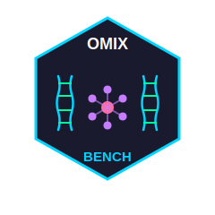

# OmixBench: A Systematic Evaluation Framework for Large Language Models in Multi-omics Analysis 

[](https://www.gnu.org/licenses/gpl-3.0)
[](https://www.r-project.org/)
[](https://github.com/SolvingLab/OmixBench/)
[](https://github.com/SolvingLab/OmixBench)
[](https://github.com/SolvingLab/OmixBench/blob/main/OmixBenchR_1.0.0.pdf)
[](mailto:liuzaoqu@163.com)

## Overview

The rapid advancement of large language models (LLMs) has opened new possibilities for automating complex analytical workflows in computational biology. However, the absence of standardized evaluation protocols makes it difficult to assess their reliability and select appropriate models for bioinformatics applications. This challenge is particularly acute in multi-omics analysis, where workflows involve intricate multi-step procedures, domain-specific software ecosystems, and diverse data modalities.

OmixBench represents an attempt to address this gap by providing a systematic evaluation framework designed specifically for assessing LLM capabilities in multi-omics analysis. The framework encompasses both theoretical understanding and practical execution, offering a dual-evaluation approach that examines methodological validity alongside real-world implementation reliability.

This repository contains the complete evaluation datasets, computational tools, and analysis scripts developed for this study, which evaluated 89 contemporary language models across bioinformatics tasks spanning ten omics domains. We hope this framework can serve as a foundation for the community to build upon, facilitating more informed decisions about LLM deployment in computational biology research.

## Framework Architecture

### Dual-Evaluation Strategy

The evaluation framework adopts a two-tiered approach to comprehensively assess LLM performance:

**Static Evaluation (1,002 tasks)**: Assesses theoretical knowledge, methodological awareness, and code generation quality without requiring actual execution. This component examines whether models can articulate biologically appropriate and statistically defensible analytical strategies.

**Dynamic Evaluation (405 tasks)**: Tests real-world implementation by executing generated code in standardized computational environments. This component evaluates whether proposed solutions can withstand practical challenges including software dependencies, version compatibility, and data schema variations.

This dual structure acknowledges that conceptual validity and executable reliability represent correlated yet partially independent capabilities. Some models may demonstrate strong theoretical understanding but struggle with execution details, while others may produce functional code with suboptimal methodological foundations.

### Coverage Across Omics Domains

The evaluation spans ten major omics domains, reflecting the diversity of contemporary bioinformatics research:

1. Genomics
2. Transcriptomics
3. Epigenomics
4. Proteomics
5. Metabolomics
6. Single-cell Omics
7. Spatial Omics
8. Microbiomics
9. Pharmacogenomics
10. Multi-omics Integration

### Task Complexity Classification

Dynamic evaluation tasks are stratified into three complexity levels based on multiple dimensions including computational requirements, analytical sophistication, and interpretative depth:

- **Level 1**: Straightforward procedures involving basic statistical operations and standard data manipulations
- **Level 2**: Multi-step workflows requiring integration of multiple analytical methods
- **Level 3**: Advanced analyses involving sophisticated algorithms, multi-omics integration, or iterative optimization

Detailed classification criteria are provided in [Task Complexity Classification.md](Task%20Complexity%20Classification.md).

## Key Features

### 1. Evaluation Framework for Multi-Omics Analysis

Building upon existing benchmarking approaches in bioinformatics, this framework offers a dual-evaluation strategy to assess LLM performance:

- **Static evaluation (1,002 tasks)**: Assesses theoretical knowledge, methodological awareness, and code generation quality without requiring execution. Examines whether models can articulate biologically appropriate and statistically defensible analytical strategies across diverse bioinformatics scenarios.

- **Dynamic evaluation (405 tasks)**: Tests real-world implementation by executing generated code in standardized computational environments. Evaluates whether proposed solutions can withstand practical challenges including software dependencies, version compatibility, and data schema variations.

- **Multi-domain coverage**: Spans ten major omics domains (genomics, transcriptomics, epigenomics, proteomics, metabolomics, single-cell omics, spatial omics, microbiomics, pharmacogenomics, and multi-omics integration).

- **Complexity stratification**: Dynamic tasks are classified into three levels based on computational requirements, analytical sophistication, and interpretative depth—from straightforward statistical operations to advanced multi-omics integration workflows.

This dual structure acknowledges that conceptual validity and executable reliability represent correlated yet partially independent capabilities, enabling assessment of whether models are better suited for methodological guidance versus code execution.

### 2. Open Benchmarking Resources

To support reproducibility and community development, this repository provides:

- **Complete task databases**: 
  - OmixTask1002: Static evaluation tasks with metadata and complexity annotations
  - OmixQA: Dynamic execution tasks with standardized data inputs and validation protocols (data available on [Synapse: syn70773121](https://www.synapse.org/Synapse:syn70773121/))

- **Evaluation frameworks**:
  - Automated static evaluation scripts with structured assessment protocols
  - Dynamic execution framework with isolated environments, error handling, and logging mechanisms
  - Visualization tools for result analysis and comparison

- **Implementation examples**:
  - Documented prompt engineering strategies for bioinformatics applications
  - Step-by-step tutorials for both static and dynamic evaluations
  - Example workflows demonstrating RAG-enhanced ReAct implementation

- **Development tools**:
  - Three R packages (`llmhelper`, `OmixBenchR`, `llmflow`) with comprehensive documentation
  - Python notebook examples for static evaluation
  - Environment configuration specifications for reproducible execution

All resources are openly available to facilitate community extensions and adaptations for different research contexts.

### 3. Practical Implementation Tools

Three R packages facilitate both evaluation and application of LLMs in bioinformatics workflows:

- **llmhelper**: Unified interface for integrating multiple LLM providers
- **OmixBenchR**: Core benchmarking framework with automated task execution
- **llmflow**: Implementation of RAG-enhanced ReAct architecture for complex analytical workflows

### 4. Technical Approaches

Based on systematic error analysis identifying **method obsolescence** and **data schema mismatches** as primary failure modes, the framework explores several strategies:

- **Dual-evaluation methodology**: Treats conceptual validity and executable reliability as partially decoupled capacities, enabling assessment of whether models are better positioned as methodological advisors versus code-executing agents

- **Chain-of-thought (CoT) reasoning enhancement**: Examines whether reasoning strategies can enable smaller models to approach the performance of larger counterparts within identical model families, as an alternative or complement to parameter scaling

- **RAG-enhanced ReAct framework**: Adapted specifically for bioinformatics code generation to address knowledge gaps observed in initial evaluations:
  - **RAG component**: Employs reasoning models to identify task-relevant functions from requirements, then retrieves current documentation with prioritized access to official function documentation over LLM-generated examples
  - **Persistent coding sessions**: Maintains isolated execution environments to preserve variable states and loaded dependencies across reasoning-action-observation cycles, addressing the limitation where computational context is typically lost between analytical steps
  - **Error management**: Implements intelligent error escalation and task degradation strategies, providing targeted guidance when systematic error patterns emerge

These approaches represent our exploration of bioinformatics-specific optimization strategies, developed iteratively based on observed failure patterns in benchmark evaluations.

## Repository Structure

```
OmixBench/
├── llmhelper/                          # R package for LLM integration
│   ├── R/                              # Source code
│   ├── man/                            # Function documentation
│   └── DESCRIPTION                     # Package metadata
├── llmhelper_1.0.0.pdf                # Package manual
│
├── OmixBenchR/                        # Core benchmarking framework
│   ├── R/                             # Source code
│   ├── man/                           # Function documentation
│   └── inst/                          # Evaluation prompts
├── OmixBenchR_1.0.0.pdf              # Package manual
│
├── llmflow/                           # RAG-enhanced ReAct framework
│   ├── R/                             # Source code
│   ├── man/                           # Function documentation
│   └── AutoFlow_Tasks.R               # Example workflows
├── llmflow_2.0.0.pdf                 # Package manual
│
├── OmixTask1002/                      # Static evaluation dataset
│   ├── OmixTask1002.xlsx              # Complete task database
│   ├── Task_Distribution.R            # Analysis scripts
│   └── Correlation.R                  # Validation analysis
│
├── OmixQA/                            # Dynamic evaluation dataset
│   ├── OmixQA-Task-Info.xlsx          # Task specifications
│   ├── DynamicEval.R                  # Execution framework
│   └── OmixQA_Distribution.R          # Distribution analysis
│
├── StaticEval/                        # Static evaluation scripts
│   ├── StaticEval.R                   # Main evaluation script
│   ├── heatmap.R                      # Visualization
│   └── Bioinformatics Code Static Evaluation Prompt.md
│
├── AutoFlow Step by Step.md           # RAG-ReAct tutorial
├── Task Complexity Classification.md   # Classification criteria
├── Code Generation of Static Task Examples.md
├── Code Evaluation of Static Task Examples.md
├── Dynamic Execution of Level 1 Tasks.md
├── Dynamic Execution of Level 2 Tasks.md
└── Dynamic Execution of Level 3 Tasks.md
```

## Core R Packages

### llmhelper: Unified LLM Integration Interface

The `llmhelper` package provides a consistent interface for interacting with multiple LLM providers, abstracting away provider-specific implementation details.

**Key Features:**
- Unified API across multiple providers (OpenAI, Anthropic, DeepSeek, Qwen, Google, etc.)
- Flexible prompt construction with system and user message separation
- JSON schema generation and validation for structured outputs
- Built-in retry mechanisms with exponential backoff
- Connection diagnostics and error handling
- Support for local deployment via Ollama

**Installation:**
```r
# Install from source
install.packages("devtools")
devtools::install_github("SolvingLab/OmixBench", subdir = "llmhelper")
```

**Documentation:** [llmhelper_1.0.0.pdf](llmhelper_1.0.0.pdf)

**Basic Usage:**
```r
library(llmhelper)

# Configure LLM client
client <- llm_provider(
  model = "gpt-4",
  base_url = Sys.getenv("OPENAI_BASE_URL"),
  api_key = Sys.getenv("OPENAI_API_KEY"),
  temperature = 0.2
)

# Construct prompt
prompt <- set_prompt(
  system = "You are an expert bioinformatician.",
  user = "Explain differential gene expression analysis."
)

# Get response
response <- get_llm_response(prompt, client)
```

### OmixBenchR: Benchmarking Framework

The `OmixBenchR` package implements the core evaluation framework, providing functions for both static code assessment and dynamic task execution.

**Key Features:**
- Automated task execution with configurable retry attempts
- Standardized evaluation metrics based on expert criteria
- Support for both static and dynamic evaluation modes
- Bioinformatics-specific prompt formatting
- Result validation and error categorization
- Integration with the llmhelper interface

**Installation:**
```r
devtools::install_github("SolvingLab/OmixBench", subdir = "OmixBenchR")
```

**Documentation:** [OmixBenchR_1.0.0.pdf](OmixBenchR_1.0.0.pdf)

**Static Evaluation Example:**
```r
library(OmixBenchR)
library(llmhelper)
library(glue)

# Configure LLM
llm_client <- llm_provider(model = "gpt-4")

# Define task
task <- "Perform batch correction on single-cell RNA-seq data using Harmony."

# Generate code
code_response <- get_llm_response(
  set_prompt(
    system = "You are an AI assistant specialized in bioinformatics. Provide complete R code solutions.",
    user = glue::glue("Please provide R code to solve the following bioinformatics task:\n\n{task}")
  ),
  response_client,
  verbose = TRUE
)

# Evaluate generated code
eval_result <- CodeEval(
  task = task,
  response = code_response,
  llm_client = llm_client
)
```

**Dynamic Execution Example:**
```r
# Download the dynamic tasks from https://www.synapse.org/Synapse:syn70773121/files/

# Setup
setwd("Qxx")
task_meta <- jsonlite::fromJSON('task_prompt.json')

# Execute with automatic error correction
result <- Execute_Task(
  task_prompt = task_meta$Task_prompt,
  llm_client = llm_client,
  timeout_sec = 1200,
  max_interactions = 10
)

# Examine results
print(result)
```

### llmflow: RAG-Enhanced ReAct Framework

The `llmflow` package implements a retrieval-augmented generation architecture combined with reasoning and acting (ReAct) paradigm, specifically designed for complex bioinformatics workflows.

**Key Features:**
- **Retrieval-Augmented Generation (RAG)**: Automatically retrieves relevant function documentation from R packages
- **ReAct Architecture**: Iterative reasoning and action cycles for multi-step problem solving
- **AutoFlow**: One-command interface combining RAG and ReAct for end-to-end workflow execution
- **State Preservation**: Maintains computational context across analytical steps
- **Error Recovery**: Intelligent error detection and correction strategies
- **Documentation Extraction**: Automatic parsing of package documentation and examples

**Installation:**
```r
devtools::install_github("SolvingLab/OmixBench", subdir = "llmflow")
```

**Documentation:** [llmflow_2.0.0.pdf](llmflow_2.0.0.pdf)

**AutoFlow Example:**
```r
library(llmflow)

# Configure LLMs (can use different models for RAG and ReAct)
rag_llm <- chat_anthropic(model = "claude-opus-4")
react_llm <- chat_deepseek(model = "deepseek-chat")

# Download the dynamic tasks from https://www.synapse.org/Synapse:syn70773121/files/

# Setup
setwd("Qxx")
task_meta <- jsonlite::fromJSON('task_prompt.json')

# Execute with AutoFlow
AutoFlow(
  task_prompt = task_meta$Task_Prompt,
  react_llm = react_llm,
  rag_llm = rag_llm
)
```

The AutoFlow function orchestrates the following workflow:
1. Task decomposition and planning
2. Relevant documentation retrieval via RAG
3. Code generation informed by retrieved documentation
4. Execution with error monitoring
5. Iterative refinement based on execution feedback

For detailed step-by-step walkthrough, see [AutoFlow Step by Step.md](AutoFlow%20Step%20by%20Step.md).

## Evaluation Datasets

### Static Task Set (OmixTask1002)

The static evaluation dataset comprises 1,002 carefully curated bioinformatics tasks covering diverse analytical scenarios across ten omics domains.

**Contents:**
- `OmixTask1002.xlsx`: Complete task database including task descriptions, domain classifications, and complexity annotations
- Task distribution analysis scripts
- Correlation analysis with human expert evaluations
- Word cloud visualizations of task characteristics

**Dataset Access:**
All static tasks are available in this repository under `OmixTask1002/`.

### Dynamic Task Set (OmixQA)

The dynamic evaluation dataset contains 405 executable tasks with standardized input data and validation criteria. Due to file size constraints, the complete dataset including input files is hosted on Synapse.

**Contents:**
- `OmixQA-Task-Info.xlsx`: Task specifications, complexity levels, and expected outputs
- Execution framework scripts
- Task distribution analysis
- Example data structures

**Dataset Access:**

Task specifications and metadata are available in this repository under `OmixQA/`. Complete task datasets including input data files are publicly available on Synapse:

**Synapse Repository:** [syn70773121](https://www.synapse.org/Synapse:syn70773121/)

To access the complete dataset:
1. Create a free Synapse account at https://www.synapse.org/
2. Navigate to syn70773121
3. Download the required datasets
4. Follow the execution instructions in the documentation

Detailed classification criteria and examples for each level are provided in [Task Complexity Classification.md](Task%20Complexity%20Classification.md).

## Getting Started

### Prerequisites

**Required Software:**
- R (≥ 4.4.0 recommended)
- RStudio (optional, but recommended)

**Required Packages:**
Core dependencies are automatically installed with the packages. Domain-specific bioinformatics packages may be required depending on the tasks being executed.

For Python users who prefer to conduct static evaluations in Python environments, we have provided a complementary notebook `OmixStaticEval_Py.ipynb` that demonstrates similar evaluation workflows using Python-based LLM interfaces. While the core benchmarking framework is implemented in R, this notebook facilitates broader accessibility for the Python community.

## Documentation

Comprehensive documentation is provided to guide users through different aspects of the framework:

### Tutorial Documents
- **[AutoFlow Step by Step.md](AutoFlow%20Step%20by%20Step.md)**: Detailed walkthrough of the RAG-enhanced ReAct framework with annotated examples
- **[Task Complexity Classification.md](Task%20Complexity%20Classification.md)**: Multi-dimensional framework for task complexity assessment

### Evaluation Examples
- **[Code Generation of Static Task Examples.md](Code%20Generation%20of%20Static%20Task%20Examples.md)**: Sample prompts and LLM-generated code for benchmark tasks
- **[Code Evaluation of Static Task Examples.md](Code%20Evaluation%20of%20Static%20Task%20Examples.md)**: Evaluation criteria and scoring examples
- **[Dynamic Execution of Level 1 Tasks.md](Dynamic%20Execution%20of%20Level%201%20Tasks.md)**: Execution walkthroughs for low-complexity tasks
- **[Dynamic Execution of Level 2 Tasks.md](Dynamic%20Execution%20of%20Level%202%20Tasks.md)**: Execution walkthroughs for moderate-complexity tasks
- **[Dynamic Execution of Level 3 Tasks.md](Dynamic%20Execution%20of%20Level%203%20Tasks.md)**: Execution walkthroughs for high-complexity tasks

### Package Manuals
- **[llmhelper_1.0.0.pdf](llmhelper_1.0.0.pdf)**: Complete function reference for the llmhelper package
- **[OmixBenchR_1.0.0.pdf](OmixBenchR_1.0.0.pdf)**: Complete function reference for the OmixBenchR package
- **[llmflow_2.0.0.pdf](llmflow_2.0.0.pdf)**: Complete function reference for the llmflow package

### Analysis Notebooks
- **[BioLLM Comparision.ipynb](BioLLM%20Comparision.ipynb)**: Comparative analysis of evaluated models

## System Requirements

### Operating System
- Linux (Ubuntu 20.04 or later recommended)
- macOS (10.15 or later)
- Windows 10/11 (with appropriate R configuration)

### Computational Resources
- Minimum: 8 GB RAM
- Recommended: 16 GB RAM or higher for dynamic task execution
- Storage: At least 50 GB free space for complete datasets

### R Environment
- R (≥ 4.0.0)
- RStudio (recommended for interactive use)
- For the detailed environment configuration, please see [Environment_Configuration.csv](https://github.com/SolvingLab/OmixBench/blob/main/Environment_Configuration.csv).

### Required R Packages

Core dependencies are automatically installed with the three main packages. Additional packages may be required depending on specific tasks:

**Essential Packages:**
- tidyverse
- jsonlite
- glue
- httr
- tidyprompt
- ellmer

**Domain-Specific Packages (examples):**
- Bioconductor core packages (BiocManager, BiocGenerics)
- Genomics: GenomicRanges, rtracklayer, VariantAnnotation
- Transcriptomics: limma, edgeR, DESeq2
- Single-cell: Seurat, SingleCellExperiment, scater
- Spatial: spatstat, STutility
- And many others depending on specific analytical requirements

## Evaluation Workflow

A typical evaluation workflow consists of the following steps:

1. **Task Selection**: Choose tasks from the static (OmixTask1002) or dynamic (OmixQA) dataset based on evaluation objectives

2. **Model Configuration**: Set up LLM client(s) using llmhelper with appropriate model specifications and hyperparameters

3. **Code Generation**: Generate solutions using the configured model, optionally with RAG enhancement for documentation retrieval

4. **Evaluation**: 
   - For static tasks: Assess code quality and methodological appropriateness using CodeEval
   - For dynamic tasks: Execute generated code and validate outputs using Execute_Task

5. **Analysis**: Aggregate results and conduct comparative analyses using provided visualization scripts

6. **Iteration**: Refine prompts or model configurations based on observed failure modes and re-evaluate

## Limitations and Considerations

We acknowledge several limitations of the current framework:

1. **Task Coverage**: While we have attempted to include diverse bioinformatics scenarios, the 1,407 total tasks cannot comprehensively cover all possible analytical workflows in multi-omics research.

2. **Evaluation Subjectivity**: Static evaluation necessarily involves subjective judgments about code quality and methodological appropriateness, despite our efforts to establish standardized criteria.

3. **Version Dependencies**: Dynamic tasks are validated in specific computational environments. Results may vary with different software versions or system configurations.

4. **Language Scope**: The current implementation focuses primarily on R-based bioinformatics workflows, reflecting common practices in the field but potentially underrepresenting Python or other language-based approaches.

5. **Temporal Validity**: Both bioinformatics methodologies and LLM capabilities evolve rapidly. Regular updates to the benchmark will be necessary to maintain relevance.

6. **Resource Requirements**: Comprehensive evaluation of all tasks across multiple models requires substantial computational resources and API access costs.

Researchers should consider these limitations when interpreting evaluation results and applying the framework to their specific contexts.

## Troubleshooting

### Common Issues and Solutions

#### Installation Problems

**Issue**: Package installation fails with dependency errors
```r
# Solution: Install dependencies explicitly
install.packages(c("tidyverse", "jsonlite", "glue", "httr"))
# Then try installing the packages again
```

**Issue**: "Cannot install from private repository"
```r
# Solution: Make sure you're using the correct syntax
devtools::install_github("SolvingLab/OmixBench", subdir = "llmhelper")
# Note: Use double quotes and correct subdir path
```

#### API Connection Issues

**Issue**: "API key not found" or authentication errors
```r
# Solution: Set API keys as environment variables
Sys.setenv(OPENAI_API_KEY = "your-key-here")
# Or add to .Renviron file:
usethis::edit_r_environ()
# Then restart R session
```

#### Memory Issues

**Issue**: R session crashes with large datasets
```r
# Solution: Increase memory limit (Windows)
memory.limit(size = 16000)

# Or use smaller subsets for testing
# Or use streaming/chunked processing
```

### Getting Help

If you encounter issues not covered here:

1. Check existing [GitHub Issues](https://github.com/SolvingLab/OmixBench/issues)
2. Review the package documentation (PDF manuals)
3. Create a new issue with:
   - Your R version (`sessionInfo()`)
   - Package versions
   - Minimal reproducible example
   - Error messages and stack traces
4. Contact maintainers at liuzaoqu@163.com

## Frequently Asked Questions (FAQ)

**Q: What LLM providers are supported?**  
A: OmixBench supports OpenAI (GPT-4, GPT-3.5), Anthropic (Claude), DeepSeek, Qwen, GLM, Kimi, Google (Gemini), and local models via Ollama.

**Q: Do I need API keys to use OmixBench?**  
A: Yes, for cloud-based LLMs. Alternatively, you can use local models through Ollama without API keys.

**Q: How much does it cost to run evaluations?**  
A: Costs depend on your LLM provider and usage. Static evaluation is cheaper than dynamic execution. Consider using local models or providers with lower costs for development and testing.

### Technical Questions

**Q: Can I add support for a new LLM provider?**  
A: Yes! Check the [Contributing Guidelines](CONTRIBUTING.md) for instructions on adding new providers to llmhelper.

**Q: How do I create custom benchmark tasks?**  
A: See the "Adding New Tasks" section in [CONTRIBUTING.md](CONTRIBUTING.md) and review existing tasks in the OmixTask1002 and OmixQA datasets.

**Q: Can I use Python instead of R?**  
A: The core framework is R-based, but we provide Python examples in `OmixStaticEval_Py.ipynb` for static evaluation. Dynamic execution currently requires R.

**Q: How do I cite OmixBench?**  
A: Use the citation information in [CITATION.cff](CITATION.cff). BibTeX and other formats will be available once the paper is published.

**Q: Are the evaluation datasets publicly available?**  
A: Yes! Static tasks are in this repository. Dynamic task data is on Synapse ([syn70773121](https://www.synapse.org/Synapse:syn70773121/)).

## Contributing

We welcome contributions from the community! Whether you're fixing bugs, adding features, improving documentation, or creating new benchmark tasks, your input is valuable.

### How to Contribute

- **Report Issues**: Found a bug? Open an issue on [GitHub Issues](https://github.com/SolvingLab/OmixBench/issues)
- **Submit Pull Requests**: Have a fix or feature? Submit a PR following our [Contributing Guidelines](CONTRIBUTING.md)
- **Add Benchmark Tasks**: Contribute new tasks to expand coverage across omics domains
- **Improve Documentation**: Help make our documentation clearer and more comprehensive
- **Share Your Experience**: Let us know how you're using OmixBench

### Guidelines

Please see [CONTRIBUTING.md](CONTRIBUTING.md) for detailed guidelines on:
- Code style and standards
- Development setup
- Testing requirements
- Pull request process
- Task contribution guidelines

### Code of Conduct

This project adheres to a [Code of Conduct](CODE_OF_CONDUCT.md). By participating, you are expected to uphold this code.

## Community and Support

### Get Help

- **Documentation**: Start with the [README](README.md) and package manuals (PDF files)
- **GitHub Issues**: Search existing issues or create a new one
- **Email**: Contact the maintainers at liuzaoqu@163.com

### Related Projects

- [tidyprompt](https://github.com/jmbuhr/tidyprompt): Tidy prompt construction for R
- [ellmer](https://github.com/hadley/ellmer): Elegant LLM interface for R
- [BiocParallel](https://bioconductor.org/packages/BiocParallel/): Parallel computing in R

## License

This project is licensed under the GNU General Public License v3.0 (GPL-3.0). See the [LICENSE](LICENSE) file for complete terms.

This work is currently under peer review. If you find this framework useful in your research, please cite:

**Systematic Evaluation and Strategic Optimization of Large Language Models for Multi-omics Analysis**

*Zaoqu Liu, Yushuai Wu, Jingkuan Yang, Ronghao Chen, Hui Xu, Jingqi Chen, Siyuan Weng, Long Liu, Jingyuan Ning, Yuyuan Zhang, Yuqing Ren, Chunguang Guo, Peng Luo, Quan Cheng, Yudi Xu, Jinhai Deng, Faming Zhao, Zhaokai Zhou, Xing Zhou, Linhai Xie, Fuchu He*

## License

This project is licensed under the GNU General Public License v3.0 (GPL-3.0). See the [LICENSE](OmixBenchR/LICENSE.md) file for complete terms.

The GPL-3.0 license ensures that this work remains free and open-source, requiring that any derivative works also be distributed under the same license terms.

## Citation

If you use OmixBench in your research, please cite:

**BibTeX:**
```bibtex
@software{Liu_OmixBench_2025,
  author = {Liu, Zaoqu and Wu, Yushuai and Yang, Jingkuan and Chen, Ronghao and Xu, Hui and Chen, Jingqi and Weng, Siyuan and Liu, Long and Ning, Jingyuan and Zhang, Yuyuan and Ren, Yuqing and Guo, Chunguang and Luo, Peng and Cheng, Quan and Xu, Yudi and Deng, Jinhai and Zhao, Faming and Zhou, Zhaokai and Zhou, Xing and Xie, Linhai and He, Fuchu},
  title = {OmixBench: Systematic Evaluation and Strategic Optimization of Large Language Models for Multi-omics Analysis},
  year = {2025},
  url = {https://github.com/SolvingLab/OmixBench},
  note = {Manuscript under peer review}
}
```

**Plain Text:**  
Liu, Z., Wu, Y., Yang, J., et al. (2025). OmixBench: Systematic Evaluation and Strategic Optimization of Large Language Models for Multi-omics Analysis. GitHub repository: https://github.com/SolvingLab/OmixBench

For citation information in other formats, see [CITATION.cff](CITATION.cff).

This work is currently under peer review. Citation information will be updated upon publication.

## Contact Information

**Contact:**
- **Maintainer**: Zaoqu Liu
- **Email**: liuzaoqu@163.com
- **ORCID**: [0000-0002-0452-742X](https://orcid.org/0000-0002-0452-742X)
- **GitHub**: [SolvingLab/OmixBench](https://github.com/SolvingLab/OmixBench)

For bug reports and technical issues, please use the [GitHub Issues](https://github.com/SolvingLab/OmixBench/issues) system.  
For general inquiries or collaboration opportunities, please contact via email.

## Acknowledgments

This work would not have been possible without the contributions of the broader bioinformatics and LLM research communities. We are grateful to:

- All contributors who helped develop and refine the evaluation tasks
- The open-source community for developing the bioinformatics tools evaluated in this framework
- LLM providers who make their models accessible for research purposes
- Colleagues who provided valuable feedback during the development process
- The Synapse platform for hosting the dynamic task datasets

We hope this framework can serve as a useful resource for the community and contribute to advancing the responsible and effective integration of LLMs in computational biology research.

<p align="center">
  <a href="https://clustrmaps.com/site/1c32n" title="Visit tracker">
    
  </a>
</p>
